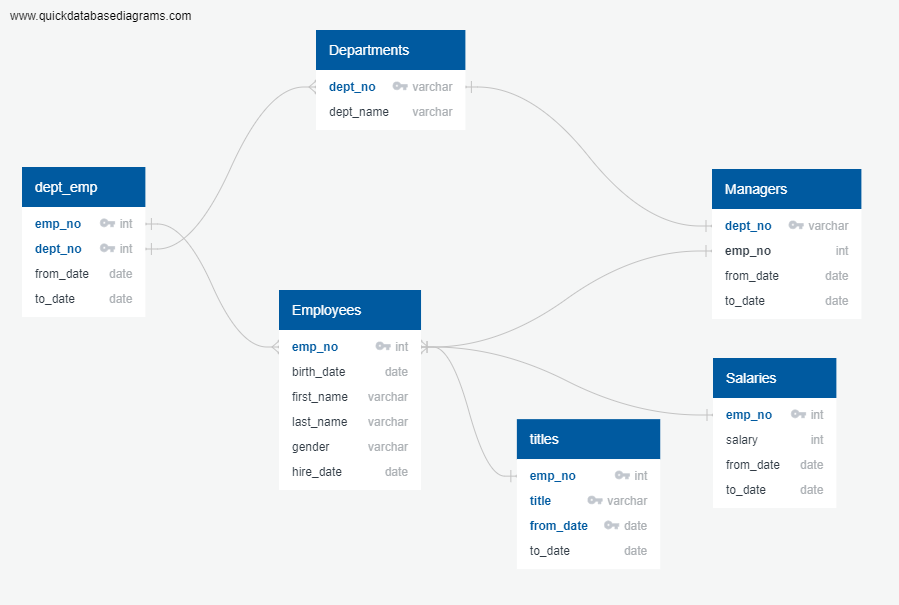

# Pewlett-Hackard-Analysis

### Introduction to the problem
  The problem mainly revolved around using SQL to sort and dig through large sets of data to procure what is necessary, which in this case is the data about the employees who are going to retire. There are two parts to this problem. The first one is about the number of retiring employees by title and the second is to create a list of employees who are eligible for the mentorship program. 
  To solve the problem he common columns and the relationship between the given tables was taken advantage of. This is the ERD diagram of the main tables that were used for this analysis. 
  
### Method used 
  - Technical Analysis Deliverable 1- 
  Three tables were to be created for this part. The first one showing the number of employees retiring by title. The second one showing number of employees with each title and the third showing a list of current employees born between Jan 1, 1952 and Dec 31, 1955. For the first table and the second table I used the count function to give the number of titles that will be retiring and the number of current employees. The third table was created by some simple join functions and a partition function to remove dupicates all the while checking if they were born within the 1952 to 1955 range. 
  - Technical Analysis Deliverable 2- 
  To create a list of eligible candidates for the mentorship program, firstly the condition of employees born in the year 1965 was considered. Two inner joins were then performed between the employees , titles and the dept_emp tables to produce the result as it is right now. Also, the duplicates were removed using the partition function. 
### Challenges encountered
The main challenge I encountered was trying to understand what exactly the Deliverable 1 was asking for. Also, the way the partition function works was difficult to understand intitailly.
### Results
- Technical Analysis Deliverable 1-
For the first table, the retirment_info table was used to generate the output so that all the retirement conditions are satisfied. The table generated is as seen below. 

The second table gets the current employees for each title with the use of the count function. Analyzing these two tables together, it is easy to compare how many employees out of the current employees are going to retire. 

And this is a part of the third table which show the current employees are eligible for retiring. 

- Technical Analysis Deliverable 2- This table shows the employees that are eligible for the mentorship program. As you can see some of them are past employees and some are current. 

### Limitations
- Technical Analysis Deliverable 1- 
Instead of using the partition function, an easier and faster way to go about this problem is to use the WHERE fucntion and check the to_date='9999-01-01' Since previous positions and titles have an end date they wouldn't be considered and will be automatically removed from the table and there wont be a problem of duplicates. Ths also make sure of the fact that we are considering only current employees. 

- Technical Analysis Deliverable 2-
Looking at the to_date column for these results it is apparent that not all of the people in the genrated list are still employees. So this depends on the mentorship programs guidelines. If the program is infact only looking for current employees then we would have to filter out the past employees by using a Where to_date ='9999-01-01' and with this we would get only current employees in the table for eligible mentors.  

